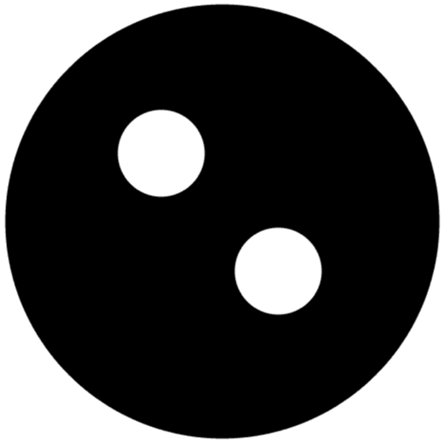

### Pieces

##### Aon

Moves one square vertically or horizontally

##### Khoyor

Moves two squares vertically or horizontally

##### Ska

Moves one square diagonally

##### San

Only moves away from the home row

### Rules

* The home row (The line closest to each player) is set (aon, khoyor, ska, ska, khoyor, aon).
* Black moves first.
* On every turn, the player can either move a piece or spawn a san on any empty square of the home row
* A piece can capture another piece of the opposite colour by moving to the same square. The captured piece is permanently removed from play.
* The game ends and a player wins when that player puts a san on the opponents' home row or the opponent has no pieces to move.
 

